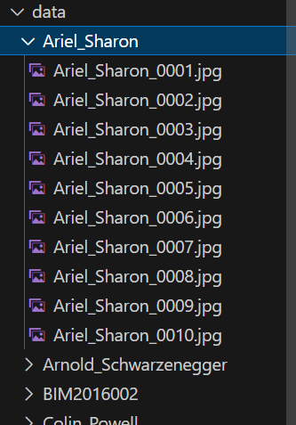

# smartsense_assignment_2


# Directory structure 

- data - contains the folder to the images of different people
- dataset - contrains two folder train and test  created using create_dataset.py
    - train - contains the images of different people
    - test - contains the images of different people
- model - contains the model.h5 files

> Note : plese following the directory structure also mentioned in the below ss


PYTHON NOTEBOOKS and FILES
- `EDA.ipynb`  - Notebook containing all the EDAs
- `create_dataset.py` - this file is used to create the dataset {train and test}
- `train.py` - this file is used to train the model
- `results.csv` - this file contains the results of the test data on different model


# How to run the code

1. app.py
2. create_dataset.py
3. train.py
4. app2.py


### Application

This file will capture the user's images to  learn the model.

To run the application, run the `app.py` file

```bash
app.py --model vgg --blocks 16 --usename sidd
```

> Command line arguments:

```python
model: str = 'vgg'
blocks: int = 16
username: str = 'sidd'
clicks: int = 5
```


> NOTE: when this application runs; It will open you camera and try to capture some images of yous `dafault = 5`
---

##### How to capture images


- Give a nice smile and ready pose :)
- Press `space` to capture the image
- Press `ESC` to stop or it will capture 5 images by default


> NOTE: The images will be saved in the `data` folder with the name `username`

---

### Dataset_creation


run the `create_dataset.py`` file to create the dataset. 

This dataset will contain two folders `train` and `test` containing the images of different people


```bash
python create_dataset.py --data data
```

> Command line arguments:

```python
data: str = 'data' # folder containing the images of different people 

```

This will create a `dataset` folder containing two subfolders.

---

### Training the model

Then run the `train.py` file to train the model


```bash
python train.py --model vgg --blocks 16 --epochs 10 --batch 32 
```

> Command line arguments:

```python
model: str = 'vgg'
blocks: int = 16
epochs: int = 10
batch: int = 32
imgsize: int = 128
optimizer: str = 'adam'
lr: float = 0.001
augment: bool = False # data augmentation
```

This will create a model folder containing the model.h5 file: for now : `vgg_16.h5`

And save the evaluation results in the `results2.csv` file

---

## Final RUN ; PREDICTION

This file will be used to predict the image lable using the trained model

#### Input to the model:

1. Open the Camera and capture the image


This will open the camera

You need to do 2 things

1. Have a nice smile and ready pose :)
2. Press `Space` to capture a image

> NOTE: The image will be saved in the `test` folder with the name `test_1.jpg`


2. Pass the command line argument `--file` to the `app2.py` file


#### Output from the code

> Image 

1. Original image 
2. Image with a box arround the face - if datected
3. Predicted Name on the Image

> Command Line:

- the prediction by the model.

```python
python app2.py --model vgg --blocks 16
```

> Command line arguments:

```python
model: str = 'vgg'
blocks: int = 16
file: str = 'test/test_1.jpg'
imgsize: int = 128
```


# our trainned Model Score

vgg16 - 4 epochs only


```=================================================================
Total params: 18,911,184
Trainable params: 4,196,496
Non-trainable params: 14,714,688
_________________________________________________________________
Epoch 1/4
26/26 [==============================] - 12s 418ms/step - loss: 24.8208 - accuracy: 0.2344
Epoch 2/4
26/26 [==============================] - 11s 403ms/step - loss: 1.8105 - accuracy: 0.8125
Epoch 3/4
26/26 [==============================] - 11s 418ms/step - loss: 0.2599 - accuracy: 0.9688
Epoch 4/4
4/4 [==============================] - 11s 413ms/step - loss: 0.2903 - accuracy: 0.9688
7/7 [==============================] - 3s 378ms/step - loss: 10.9425 - accuracy: 0.2500
```


